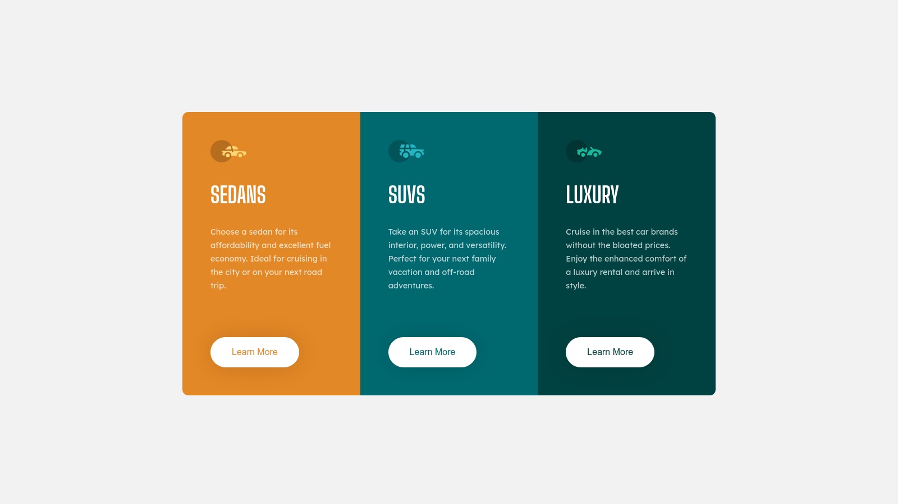

# 3-column Preview Card Component

Difficulty: 🟩 **Easy**

Tags: **HTML**, **CSS**

Level: 1, **Newbie**

Link: https://www.frontendmentor.io/challenges/3column-preview-card-component-pH92eAR2-

My Solution:

## Required Knowledge
- CSS Grid (You can also use Flexbox)
- Flexbox
- CSS Transitions & Animations
- Pseudo Classes (eg. hover states)
- Responsive Web Design (eg. media queries, meta viewport tag..)
- Box Model
- Basic CSS (eg. border-radius, box-shadow)
- HTML Semantic Tags
