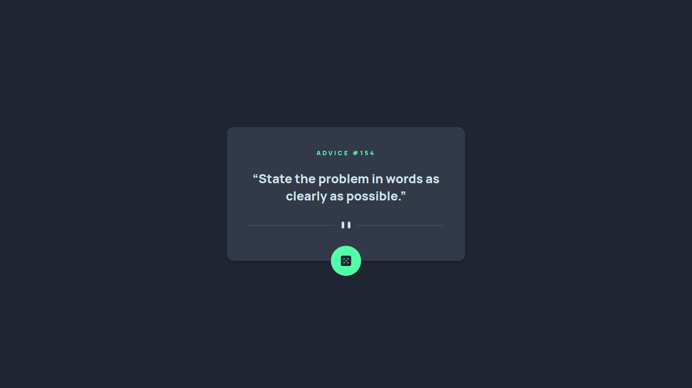

# Advice Generator App

Difficulty: 🟩 **Easy**

Tags: **HTML**, **CSS**, **JS**, **API**

Level: 2, **Junior**

Link: https://www.frontendmentor.io/challenges/advice-generator-app-QdUG-13db

My Solution:

## Required Knowledge
- Fetch API or AJAX (eg. fetch(), XHR)
- Basic HTTP (eg. HTTP methods, REST API)
- Async JavaScript (eg. async/await, promises..)
- Basic JavaScript
- Basic DOM Manipulation
- Events
- Responsive Web Design (eg. media queries, meta viewport tag..)
- Focus States (eg. focus, enabled)
- Pseudo Classes (eg. hover states)
- CSS Transitions & Animations
- Box Model
- Basic CSS (eg. border-radius, box-shadow)
- Basic HTML
