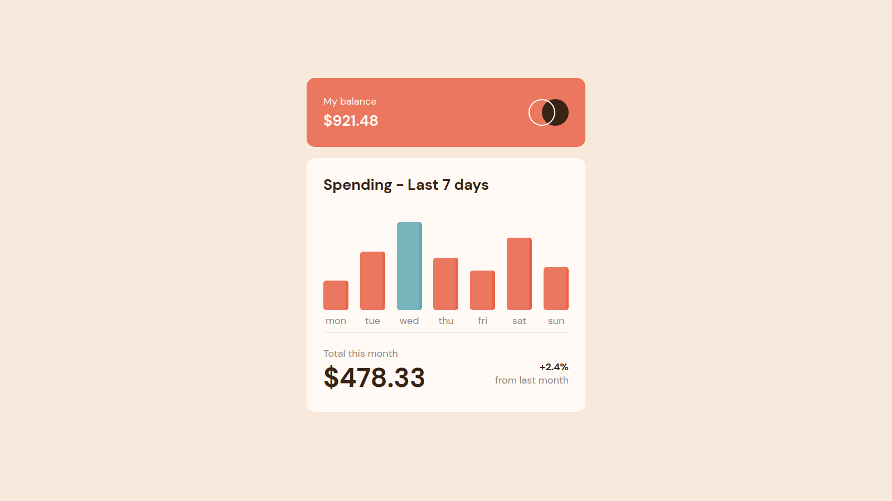

# Tip Calculator App

Difficulty: 🟩 **Easy**

Tags: **HTML**, **CSS**, **JS**

Level: 2, **Junior**

Link: https://www.frontendmentor.io/challenges/tip-calculator-app-ugJNGbJUX

My Solution:

## Required Knowledge
- Fetch JSON data (ie. fetch() method)
- Basic JavaScript
- Basic DOM Manipulation
- Array Functions (eg. map, forEach)
- Flexbox
- CSS Positioning
- Responsive Web Design (eg. media queries, meta viewport tag..)
- Pseudo Classes (eg. hover states)
- CSS Transitions & Animations
- Box Model
- Basic CSS (eg. border-radius, box-shadow)
- Basic HTML
