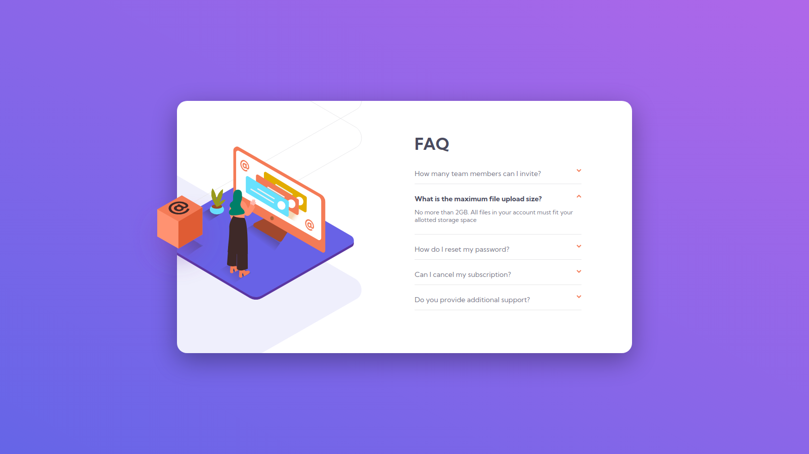

# FAQ Accordion Card

Difficulty: 🟩 **Easy**

Tags: **HTML**, **CSS**, **JS**

Level: 1, **Newbie**

Link: https://www.frontendmentor.io/challenges/faq-accordion-card-XlyjD0Oam

My Solution:

## Required Knowledge
- Basic JavaScript
- Basic DOM Manipulation
- Array Functions (eg. map, forEach)
- Events
- CSS Background Positioning
- Flexbox
- Responsive Web Design (eg. media queries, meta viewport tag..)
- Pseudo Classes (eg. hover states)
- CSS Transitions & Animations
- Box Model
- Basic CSS (eg. border-radius, box-shadow)
- Basic HTML
