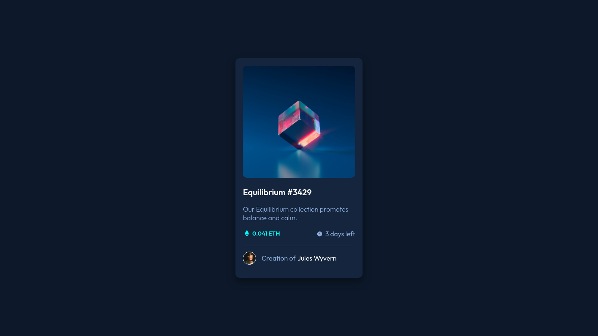

# NFT Preview Card Component

Difficulty: 🟩 **Easy**

Tags: **HTML**, **CSS**

Level: 1, **Newbie**

Link: https://www.frontendmentor.io/challenges/nft-preview-card-component-SbdUL_w0U

My Solution:

## Required Knowledge
- Flexbox
- Responsive Web Design (eg. media queries, meta viewport tag..)
- Pseudo Elements (::before and ::after)
- Pseudo Classes (eg. hover states)
- CSS Transitions & Animations
- CSS Positioning (eg. position: relative, absolute)
- Box Model
- Basic CSS (eg. border-radius, box-shadow)
- HTML Semantic Tags
