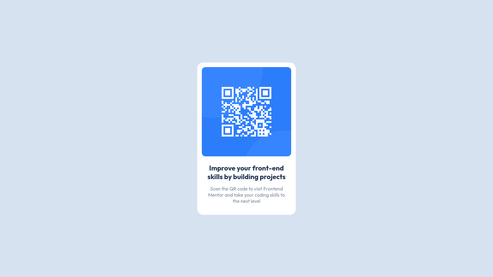

# QR Code Component

Difficulty: 🟩 **Easy**

Tags: **HTML**, **CSS**

Level: 1, **Newbie**

Link: https://www.frontendmentor.io/challenges/qr-code-component-iux_sIO_H

My Solution:

## Required Knowledge
- Flexbox (Centering `div` elements)
- Box Model
- Basic CSS (eg. border-radius, box-shadow)
