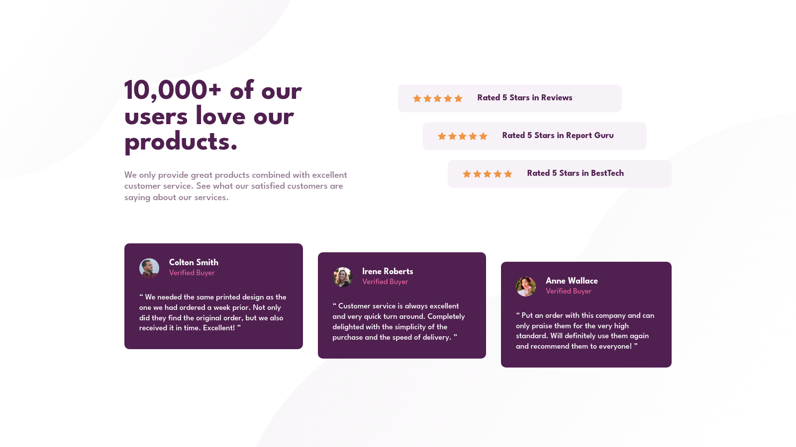

# Social Proof Section

Difficulty: 🟩 **Easy**

Tags: **HTML**, **CSS**

Level: 1, **Newbie**

Link: https://www.frontendmentor.io/challenges/social-proof-section-6e0qTv_bA/hub/social-proof-section-adXyisXT-j

My Solution:

## Required Knowledge
- CSS Grid
- Flexbox
- Responsive Web Design (eg. media queries, meta viewport tag..)
- Pseudo Elements (::before and ::after)
- Box Model
- Basic CSS (eg. border-radius, box-shadow)
- HTML Semantic Tags
